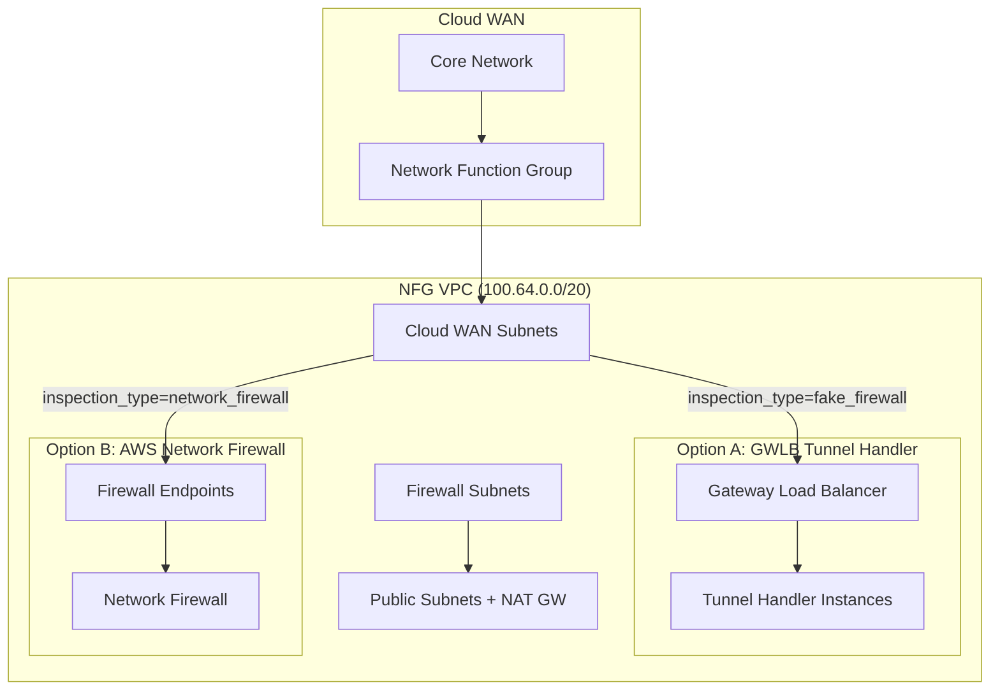

# Design Document: Network Firewall Option

## Overview

This design adds AWS Network Firewall as an alternative traffic inspection mechanism to the existing Gateway Load Balancer with tunnel handler (`fake_firewall`) implementation. The solution introduces a new input variable `inspection_type` that allows operators to select between the two inspection options, with the existing GWLB tunnel handler remaining as the default.

The Network Firewall implementation will integrate with the existing NFG VPC architecture, deploying firewall endpoints in the firewall subnets and configuring appropriate routing to ensure traffic flows through the inspection layer before reaching its destination.

## Architecture

### High-Level Architecture



### Traffic Flow with Network Firewall

1. Traffic enters NFG VPC via Cloud WAN attachment subnets
2. Routes direct traffic to Network Firewall endpoints in firewall subnets
3. Network Firewall inspects traffic against stateful rule groups
4. Allowed traffic is forwarded to destination via Cloud WAN
5. Return traffic follows the same path in reverse

### Conditional Resource Deployment

The `inspection_type` variable controls which resources are deployed:

| Resource | inspection_type = "fake_firewall" | inspection_type = "network_firewall" |
|----------|------------------------------|--------------------------------------|
| GWLB | ✓ | ✗ |
| Tunnel Handler EC2 | ✓ | ✗ |
| GWLB Endpoints | ✓ | ✗ |
| Network Firewall | ✗ | ✓ |
| NFW Rule Groups | ✗ | ✓ |
| NFW Policy | ✗ | ✓ |
| NFW Logging | ✗ | ✓ |

## Components and Interfaces

### New Input Variable

```hcl
variable "inspection_type" {
  description = "Type of inspection to deploy: fake_firewall (GWLB with tunnel handler) or network_firewall (AWS Network Firewall)"
  type        = string
  default     = "fake_firewall"
  
  validation {
    condition     = contains(["fake_firewall", "network_firewall"], var.inspection_type)
    error_message = "inspection_type must be either 'fake_firewall' or 'network_firewall'."
  }
}
```

### Network Firewall Resources

#### 1. Stateful Rule Group (ICMP and HTTP)

```hcl
resource "aws_networkfirewall_rule_group" "allow_icmp_http" {
  for_each = var.inspection_type == "network_firewall" ? { 
    for el in var.core_network_config.edge_locations : el.region => el if el.inspection 
  } : {}

  region   = each.value.region
  capacity = 100
  name     = format("%s-%s-nfwrg-allow", var.project_code, local.region_short_names[each.key])
  type     = "STATEFUL"
  
  rule_group {
    rules_source {
      # ICMP Allow Rule
      stateful_rule {
        action = "PASS"
        header {
          destination      = "ANY"
          destination_port = "ANY"
          direction        = "ANY"
          protocol         = "ICMP"
          source           = "ANY"
          source_port      = "ANY"
        }
        rule_option {
          keyword  = "sid"
          settings = ["1"]
        }
      }
      # HTTP Allow Rule
      stateful_rule {
        action = "PASS"
        header {
          destination      = "ANY"
          destination_port = "80"
          direction        = "ANY"
          protocol         = "TCP"
          source           = "ANY"
          source_port      = "ANY"
        }
        rule_option {
          keyword  = "sid"
          settings = ["2"]
        }
      }
    }
  }
}
```

#### 2. Firewall Policy

```hcl
resource "aws_networkfirewall_firewall_policy" "this" {
  for_each = var.inspection_type == "network_firewall" ? { 
    for el in var.core_network_config.edge_locations : el.region => el if el.inspection 
  } : {}

  region = each.value.region
  name   = format("%s-%s-nfwpol", var.project_code, local.region_short_names[each.key])

  firewall_policy {
    stateless_default_actions          = ["aws:forward_to_sfe"]
    stateless_fragment_default_actions = ["aws:forward_to_sfe"]
    
    stateful_rule_group_reference {
      resource_arn = aws_networkfirewall_rule_group.allow_icmp_http[each.key].arn
    }
  }
}
```

#### 3. Network Firewall

```hcl
resource "aws_networkfirewall_firewall" "this" {
  for_each = var.inspection_type == "network_firewall" ? { 
    for el in var.core_network_config.edge_locations : el.region => el if el.inspection 
  } : {}

  region              = each.value.region
  name                = format("%s-%s-nfw", var.project_code, local.region_short_names[each.key])
  firewall_policy_arn = aws_networkfirewall_firewall_policy.this[each.key].arn
  vpc_id              = module.nfg_vpc[each.key].vpc_attributes.id

  dynamic "subnet_mapping" {
    for_each = { for k, v in module.nfg_vpc[each.key].private_subnet_attributes_by_az : 
                split("/", k)[1] => v.id if split("/", k)[0] == "nfw" }
    content {
      subnet_id = subnet_mapping.value
    }
  }
}
```

#### 4. CloudWatch Logging

```hcl
resource "aws_cloudwatch_log_group" "nfw" {
  for_each = var.inspection_type == "network_firewall" ? { 
    for el in var.core_network_config.edge_locations : el.region => el if el.inspection 
  } : {}

  region            = each.value.region
  name              = format("/aws/networkfirewall/%s-%s-nfw", var.project_code, local.region_short_names[each.key])
  retention_in_days = 7
}

resource "aws_networkfirewall_logging_configuration" "this" {
  for_each = var.inspection_type == "network_firewall" ? { 
    for el in var.core_network_config.edge_locations : el.region => el if el.inspection 
  } : {}

  region       = each.value.region
  firewall_arn = aws_networkfirewall_firewall.this[each.key].arn

  logging_configuration {
    log_destination_config {
      log_destination = {
        logGroup = aws_cloudwatch_log_group.nfw[each.key].name
      }
      log_destination_type = "CloudWatchLogs"
      log_type             = "ALERT"
    }
  }
}
```

### Routing Configuration

Routes from Cloud WAN attachment subnets to firewall endpoints:

```hcl
resource "aws_route" "nfg_cwn_to_nfw" {
  for_each = var.inspection_type == "network_firewall" ? { 
    for rt in local.nfg_cwn_routes : "${rt.vpc_key}-${rt.az_id}" => rt 
  } : {}

  region                 = each.value.vpc_key
  route_table_id         = each.value.rt_id
  destination_cidr_block = "0.0.0.0/0"
  vpc_endpoint_id        = local.nfw_endpoint_ids[each.key]
}
```

## Data Models

### Local Variables for Network Firewall Endpoints

```hcl
locals {
  # Extract Network Firewall endpoint IDs by AZ
  nfw_endpoint_ids = var.inspection_type == "network_firewall" ? {
    for region_key, fw in aws_networkfirewall_firewall.this : 
    region_key => {
      for sync_state in fw.firewall_status[0].sync_states :
      sync_state.availability_zone => sync_state.attachment[0].endpoint_id
    }
  } : {}
}
```

### Conditional Resource Selection

The existing `local.nfg_nfw_subnets` and `local.nfg_cwn_routes` locals will be reused, with conditional logic to select the appropriate endpoint type based on `inspection_type`.

## Correctness Properties

*A property is a characteristic or behavior that should hold true across all valid executions of a system-essentially, a formal statement about what the system should do. Properties serve as the bridge between human-readable specifications and machine-verifiable correctness guarantees.*

Based on the prework analysis, the following correctness properties have been identified:

### Property 1: Inspection Type Mutual Exclusivity

*For any* valid `inspection_type` value, exactly one inspection mechanism SHALL be deployed - either GWLB tunnel handler resources OR Network Firewall resources, but never both simultaneously.

**Validates: Requirements 1.1, 1.2**

### Property 2: Invalid Inspection Type Rejection

*For any* string value that is not "fake_firewall" or "network_firewall", the Terraform configuration SHALL fail validation with an appropriate error message.

**Validates: Requirements 1.4**

### Property 3: Network Firewall Rule Group Completeness

*For any* Network Firewall deployment, the stateful rule group SHALL contain rules that permit both ICMP protocol traffic and HTTP traffic on port 80.

**Validates: Requirements 2.1, 3.1**

### Property 4: Firewall Endpoint Subnet Placement

*For any* Network Firewall deployment, firewall endpoints SHALL be created in all firewall subnets of the NFG VPC across all configured availability zones.

**Validates: Requirements 4.1**

### Property 5: Logging Configuration Completeness

*For any* Network Firewall deployment, a CloudWatch Log Group SHALL exist and the firewall logging configuration SHALL reference that log group for ALERT logs.

**Validates: Requirements 5.1, 5.2**

## Error Handling

### Variable Validation

The `inspection_type` variable includes a validation block that rejects invalid values at plan time:

```hcl
validation {
  condition     = contains(["fake_firewall", "network_firewall"], var.inspection_type)
  error_message = "inspection_type must be either 'fake_firewall' or 'network_firewall'."
}
```

### Resource Dependencies

Network Firewall resources have explicit dependencies to ensure proper creation order:
1. Rule Group → Firewall Policy → Firewall → Logging Configuration
2. VPC and Subnets → Firewall (subnet_mapping)
3. CloudWatch Log Group → Logging Configuration

### Conditional Resource Creation

All Network Firewall resources use conditional `for_each` expressions that evaluate to empty maps when `inspection_type != "network_firewall"`, ensuring clean resource management.

## Testing Strategy

### Dual Testing Approach

This implementation requires both unit testing and property-based testing to ensure correctness:

#### Unit Tests

Unit tests will verify specific configurations and edge cases:

1. **Default Value Test**: Verify `inspection_type` defaults to "fake_firewall"
2. **GWLB Deployment Test**: Verify GWLB resources are created when `inspection_type = "fake_firewall"`
3. **NFW Deployment Test**: Verify Network Firewall resources are created when `inspection_type = "network_firewall"`
4. **Rule Group Content Test**: Verify ICMP and HTTP rules exist in the rule group
5. **Logging Configuration Test**: Verify CloudWatch Log Group and logging configuration are properly linked

#### Property-Based Testing

Property-based tests will use Terraform's testing framework with the `terraform test` command. Tests will be located in `tests/` directory.

**Testing Framework**: Terraform native testing (`terraform test`) with `.tftest.hcl` files

**Minimum Iterations**: Each property test should run with multiple variable combinations to ensure coverage.

**Test File Structure**:
```
tests/
├── inspection_type_validation.tftest.hcl
├── gwlb_deployment.tftest.hcl
├── nfw_deployment.tftest.hcl
└── nfw_rules.tftest.hcl
```

**Property Test Annotations**: Each test file will include a comment referencing the correctness property:
```hcl
# **Feature: networkfirewall, Property 1: Inspection Type Mutual Exclusivity**
```

### Integration Testing

Integration tests will be performed manually after deployment to verify:
1. ICMP connectivity between segments through Network Firewall
2. HTTP connectivity between segments through Network Firewall
3. CloudWatch Logs receiving firewall alerts

## File Changes Summary

| File | Change Type | Description |
|------|-------------|-------------|
| `variables.tf` | Modify | Add `inspection_type` variable with validation |
| `inspection.tf` | Modify | Add conditional logic for GWLB resources, add Network Firewall resources |
| `locals.tf` | Modify | Add locals for Network Firewall endpoint ID extraction |
| `terraform.tfvars` | Modify | Optionally set `inspection_type` value |
| `tests/*.tftest.hcl` | Create | Property-based tests for inspection type selection |
