# AWS Cloud WAN PoC Architecture Diagram

## Mermaid Diagram

```mermaid
graph TB
    subgraph "On-Premises / SD-WAN"
        SDWAN[SD-WAN Instance<br/>FRRouting BGP<br/>172.16.0.0/16, 172.18.0.0/16]
    end

    subgraph "AWS Cloud WAN Core Network"
        CWAN[Cloud WAN<br/>Global Network<br/>ASN: 65000-65100]
        
        subgraph "Segments"
            SEG_PRO[Production Segment<br/>Isolated]
            SEG_NPD[Non-Production Segment<br/>Isolated]
            SEG_SHR[Shared Services Segment<br/>Shared with all]
            SEG_NVA[NVA Segment<br/>Inspection]
            SEG_HYB[Hybrid Segment<br/>SD-WAN/VPN]
        end
        
        subgraph "Network Function Group"
            NFG[Inspection NFG<br/>Service Insertion]
        end
    end

    subgraph "Region: eu-central-1 (10.0.0.0/16)"
        subgraph "Inspection Layer"
            NFG_VPC_EUC1[NFG VPC<br/>100.64.0.0/20<br/>Appliance Mode]
            NFW_VPC_EUC1[NFW VPC<br/>10.0.255.0/24<br/>Network Firewall + GWLB]
        end
        
        subgraph "Shared Services"
            SHR_VPC_EUC1[Shared VPC<br/>10.0.250.0/24<br/>VPC Endpoints<br/>Route53 Resolver]
        end
        
        subgraph "SD-WAN"
            SDW_VPC_EUC1[SD-WAN VPC<br/>10.0.254.0/24<br/>Connect Tunnel-Less]
        end
        
        subgraph "Workloads"
            PRO_VPC_EUC1[Production VPC<br/>10.0.0.0/24<br/>+ Secondary CIDR]
            DEV_VPC_EUC1[Dev VPC<br/>10.0.64.0/24<br/>+ Secondary CIDR]
        end
    end

    subgraph "Region: eu-south-2 (10.1.0.0/16)"
        subgraph "Inspection Layer "
            NFG_VPC_EUS2[NFG VPC<br/>100.64.0.0/20<br/>Appliance Mode]
            NFW_VPC_EUS2[NFW VPC<br/>10.1.255.0/24<br/>Network Firewall + GWLB]
        end
        
        subgraph "Shared Services "
            SHR_VPC_EUS2[Shared VPC<br/>10.1.250.0/24<br/>VPC Endpoints<br/>Route53 Resolver]
        end
        
        subgraph "Workloads "
            PRO_VPC_EUS2[Production VPC<br/>10.1.0.0/24]
            DEV_VPC_EUS2[Dev VPC<br/>10.1.64.0/24]
        end
    end

    subgraph "Region: eu-south-1 (10.2.0.0/16)"
        subgraph "Workloads  "
            DEV_VPC_EUS1[Dev VPC<br/>10.2.64.0/24]
        end
        
        subgraph "Shared Services  "
            SHR_VPC_EUS1[Shared VPC<br/>10.2.250.0/24]
        end
    end

    subgraph "Region: eu-west-1 (10.3.0.0/16)"
        subgraph "Workloads   "
            DEV_VPC_EUW1[Dev VPC<br/>10.3.64.0/24]
        end
        
        subgraph "Shared Services   "
            SHR_VPC_EUW1[Shared VPC<br/>10.3.250.0/24]
        end
    end

    %% SD-WAN Connections
    SDWAN -->|BGP Peering<br/>Connect Tunnel-Less| SDW_VPC_EUC1
    SDW_VPC_EUC1 -->|Hybrid Segment| SEG_HYB

    %% Segment Attachments
    PRO_VPC_EUC1 -->|Attachment| SEG_PRO
    DEV_VPC_EUC1 -->|Attachment| SEG_NPD
    PRO_VPC_EUS2 -->|Attachment| SEG_PRO
    DEV_VPC_EUS2 -->|Attachment| SEG_NPD
    DEV_VPC_EUS1 -->|Attachment| SEG_NPD
    DEV_VPC_EUW1 -->|Attachment| SEG_NPD
    
    SHR_VPC_EUC1 -->|Attachment| SEG_SHR
    SHR_VPC_EUS2 -->|Attachment| SEG_SHR
    SHR_VPC_EUS1 -->|Attachment| SEG_SHR
    SHR_VPC_EUW1 -->|Attachment| SEG_SHR
    
    NFG_VPC_EUC1 -->|NFG Attachment| NFG
    NFG_VPC_EUS2 -->|NFG Attachment| NFG
    NFW_VPC_EUC1 -->|Attachment| SEG_NVA
    NFW_VPC_EUS2 -->|Attachment| SEG_NVA

    %% Inspection Flow
    NFG -->|Service Insertion<br/>send-via| NFG_VPC_EUC1
    NFG -->|Service Insertion<br/>send-via| NFG_VPC_EUS2
    NFG_VPC_EUC1 -.->|GWLB Endpoint| NFW_VPC_EUC1
    NFG_VPC_EUS2 -.->|GWLB Endpoint| NFW_VPC_EUS2

    %% Segment Relationships
    SEG_PRO -.->|Inspected Traffic| NFG
    SEG_NPD -.->|Inspected Traffic| NFG
    SEG_HYB -.->|Inspected Traffic| NFG
    
    SEG_PRO -.->|Access| SEG_SHR
    SEG_NPD -.->|Access| SEG_SHR
    SEG_HYB -.->|Access| SEG_SHR

    %% Styling
    classDef cwan fill:#FF9900,stroke:#232F3E,stroke-width:3px,color:#fff
    classDef segment fill:#3F8624,stroke:#232F3E,stroke-width:2px,color:#fff
    classDef inspection fill:#D13212,stroke:#232F3E,stroke-width:2px,color:#fff
    classDef shared fill:#527FFF,stroke:#232F3E,stroke-width:2px,color:#fff
    classDef workload fill:#7AA116,stroke:#232F3E,stroke-width:2px,color:#fff
    classDef sdwan fill:#FF9900,stroke:#232F3E,stroke-width:2px,color:#fff
    
    class CWAN cwan
    class SEG_PRO,SEG_NPD,SEG_SHR,SEG_NVA,SEG_HYB segment
    class NFG,NFG_VPC_EUC1,NFG_VPC_EUS2,NFW_VPC_EUC1,NFW_VPC_EUS2 inspection
    class SHR_VPC_EUC1,SHR_VPC_EUS2,SHR_VPC_EUS1,SHR_VPC_EUW1 shared
    class PRO_VPC_EUC1,DEV_VPC_EUC1,PRO_VPC_EUS2,DEV_VPC_EUS2,DEV_VPC_EUS1,DEV_VPC_EUW1 workload
    class SDWAN,SDW_VPC_EUC1 sdwan
```



## Architecture Components Legend

### Colors
- **Orange**: Cloud WAN Core Network & SD-WAN
- **Green**: Network Segments
- **Red**: Inspection Layer (NFG, Network Firewall)
- **Blue**: Shared Services (VPC Endpoints, DNS)
- **Light Green**: Workload VPCs

### Connection Types
- **Solid Lines**: Direct attachments and connections
- **Dashed Lines**: Traffic flow and access relationships

### Key Features

1. **Multi-Region Deployment**: 4 AWS regions (eu-central-1, eu-south-2, eu-south-1, eu-west-1)

2. **Segment Isolation**:
   - Production and Non-Production segments are isolated
   - All segments can access Shared Services
   - Hybrid segment for SD-WAN/VPN connectivity

3. **Centralized Inspection**:
   - Network Function Group (NFG) for service insertion
   - Traffic between segments flows through inspection VPCs
   - AWS Network Firewall with Gateway Load Balancer

4. **SD-WAN Integration**:
   - Connect Tunnel-Less attachment (NO_ENCAP)
   - BGP peering with FRRouting
   - Announces on-premises CIDRs (172.16.0.0/16, 172.18.0.0/16)

5. **Shared Services**:
   - VPC Endpoints for AWS services
   - Route 53 Resolver for DNS
   - Cross-region DNS forwarding

6. **CIDR Allocation**:
   - Regional CIDRs: 10.x.0.0/16 per region
   - Inspection VPCs: 100.64.0.0/20 (non-routable)
   - NFW VPCs: 10.x.255.0/24
   - Shared VPCs: 10.x.250.0/24
   - SD-WAN VPCs: 10.x.254.0/24
   - Workload VPCs: Various /24 subnets

## Traffic Flow Examples

### Inter-Segment Traffic (e.g., Production to Non-Production)
1. Traffic leaves Production VPC
2. Enters Cloud WAN Production Segment
3. Cloud WAN send-via policy routes to NFG
4. NFG VPC forwards to Network Firewall via GWLB endpoint
5. Network Firewall inspects and allows/denies
6. Traffic returns to Cloud WAN
7. Cloud WAN routes to Non-Production Segment
8. Traffic arrives at destination VPC

### SD-WAN to Cloud Traffic
1. On-premises traffic arrives at SD-WAN instance
2. BGP routes traffic to Cloud WAN via Connect Tunnel-Less
3. Cloud WAN routes to Hybrid Segment
4. Traffic inspected via NFG (if destined to other segments)
5. Traffic reaches destination segment and VPC

### Shared Services Access
1. Workload VPC sends request to AWS service (e.g., S3)
2. Cloud WAN routes to Shared Services Segment
3. VPC Endpoint in Shared Services VPC handles request
4. Response returns via Cloud WAN

### Cross-Region Communication
1. VPC in eu-central-1 sends traffic to VPC in eu-south-2
2. Cloud WAN routes between regions
3. Traffic inspected via NFG in appropriate region
4. Traffic arrives at destination VPC

## Routing Policies

### Applied Policies
1. **secondaryCidrFiltering**: Blocks 100.64.0.0/10 from VPC attachments
2. **summarizeCloud**: Aggregates regional CIDRs (10.x.0.0/16) on outbound
3. **blockSDWanTransit**: Prevents SD-WAN VPC CIDRs from transiting
4. **blockInsideCidrs**: Blocks Cloud WAN inside CIDRs (192.168.0.0/16)

### Attachment Routing Policy Rules
- **Rule 100**: VPC attachments → secondaryCidrFiltering
- **Rule 110**: Hybrid attachments → summarizeCloud, blockSDWanTransit, blockInsideCidrs

## To Convert to PNG

You can convert this Mermaid diagram to PNG using:

1. **Online Tools**:
   - https://mermaid.live/
   - Copy the mermaid code and export as PNG

2. **CLI Tools**:
   ```bash
   npm install -g @mermaid-js/mermaid-cli
   mmdc -i architecture.md -o architecture.png
   ```

3. **VS Code Extension**:
   - Install "Markdown Preview Mermaid Support"
   - Preview and export

4. **Draw.io**:
   - Import Mermaid diagram
   - Customize and export
